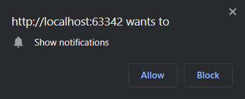
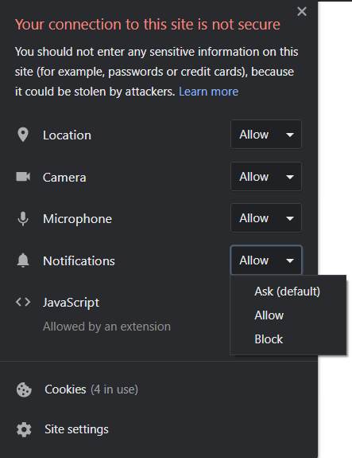

# notifications-sample
A sample project to explore the notification feature.

### API(s)
+ Notifications

### Instructions
+ Click the `Show notification` button to make a notification popup.
+ If it is your first time running this example, you are asked to grant/deny the notifications permission to the browser.
    
+ If you click `Allow`, the notification will appear.
+ If you click `Block`, an error alert will pop up.
+ You can still make the notifications permission popup appear by clicking on the Info button near the page URL and
 setting that permission properly. To apply the update, reload the page.
    

### Notes
+ The project has been tested on
    + Google Chrome 87 (both Desktop and mobile)
    + Mozilla Firefox 83 (both Desktop and mobile)

### Documentation and useful resources
+ [Notifications API](https://developer.mozilla.org/en-US/docs/Web/API/Notifications_API)
+ [Using the Notifications API](https://developer.mozilla.org/en-US/docs/Web/API/Notifications_API/Using_the_Notifications_API)
+ [ServiceWorkerRegistration.showNotification() method](https://developer.mozilla.org/en-US/docs/Web/API/ServiceWorkerRegistration/showNotification)
